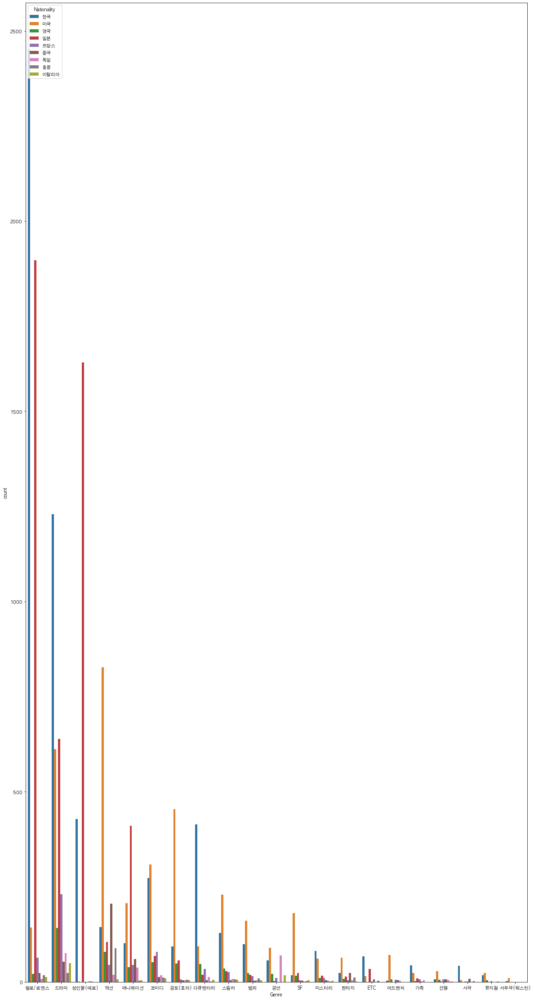

## graphs of every country according to 'National_Audience', 'National_number_screens', 'National_Sales','National_Audience', 'Seoul_Sales', 'Seoul_Audience' 

## Genre graphs from popular 9 countries

## rating difference in top movie countries 

## top movies in the top movie country list

## top movie country's popular word in top movies

## yearly changes of movie numbers of top movie countries 

## comparing the distribution of movies in different countries

## distribution graphs

## GIthub code

<https://github.com/danielsun888/datathon/blob/main/daniel2.ipynb>
